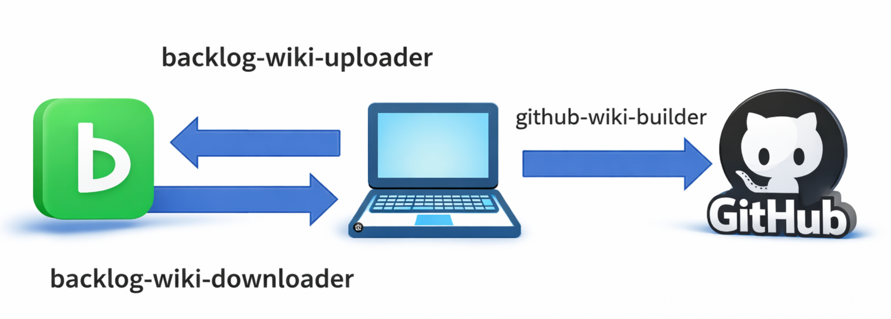

# Backlog Wiki Sync

A command-line tool to sync Wiki pages between Backlog and your local environment.

**Download → Edit locally → Upload** workflow for Backlog Wiki.

## Overview

This package provides three commands:

- **backlog-wiki-downloader**: Download Wiki pages from Backlog in Markdown format
- **backlog-wiki-uploader**: Upload edited pages back to Backlog
- **github-wiki-builder**: Convert downloaded Wiki to GitHub Wiki format



## Features

### Downloader
- Bulk download all Wiki pages from a specified project
- Filter and download only specific hierarchies
- Preserve Wiki hierarchical structure as folders
- Automatically download attachments (images, etc.)
- Convert Backlog notation to Markdown format
- Create `index.md` (content) and `memo.md` (Backlog URL and page name) in each folder

### Uploader
- Upload local Wiki pages back to Backlog
- Upload attachments (images) that don't exist on Backlog
- Read `memo.md` to find corresponding Backlog Wiki page
- Convert Markdown notation back to Backlog format
- Upload specific page by URL or all pages at once
- Dry-run mode to preview changes without uploading

### GitHub Wiki Builder
- Convert downloaded Wiki folder to GitHub Wiki format
- Generate `_Sidebar.md` with collapsible navigation (HTML `<details>` tags)
- Copy pages and images with safe ASCII-only filenames
- Configurable path separator (default: ` › `)
- Configurable sidebar expansion level (default: 2 levels)
- Remove duplicate h1 titles (GitHub Wiki shows filename as title)

## Installation

### Using pip

```bash
git clone https://github.com/furuya02/backlog-wiki-sync.git
cd backlog-wiki-sync
pip install -e .
```

After installing with pip, all commands will be available globally:

```bash
backlog-wiki-downloader
backlog-wiki-uploader
github-wiki-builder
```

## Configuration File

You can create a `.backlog-wiki-sync.json` file in the current directory to avoid entering credentials each time.

```json
{
  "space_url": "https://xxx.backlog.com",
  "project_key": "MYPRJ",
  "api_key": "YOUR_API_KEY",
  "wiki_prefix": "",
  "output_dir": "Wiki"
}
```

When the config file exists, the tools will automatically load values from it. Command-line arguments take precedence over config values.

> **Note**: The config file contains your API key. It is automatically added to `.gitignore` to prevent accidental commits.

### GitHub Wiki Builder Configuration

You can create a `.github-wiki-builder.json` file:

```json
{
  "wiki_path": "./Wiki",
  "output_path": "./github-wiki"
}
```

## Usage (Downloader)

### Interactive mode (Recommended)

```bash
backlog-wiki-downloader
```

Follow the prompts to enter:
1. Backlog space URL (e.g., `https://xxx.backlog.com`)
2. Project key (e.g., `MY_PRJ`)
3. API key (hidden during input)
4. Wiki hierarchy filter (e.g., `Development/Design`, leave empty for all)

### Command-line arguments mode

```bash
backlog-wiki-downloader \
  --url https://xxx.backlog.com \
  --project MY_PRJ \
  --api-key YOUR_API_KEY
```

### Download specific hierarchy only

```bash
backlog-wiki-downloader \
  --url https://xxx.backlog.com \
  --project MY_PRJ \
  --api-key YOUR_API_KEY \
  --prefix "Development/Design"
```

### Options

```
usage: backlog-wiki-downloader [-h] [-u URL] [-p PROJECT] [-k API_KEY] [-f PREFIX] [-o OUTPUT]

Download Wiki pages from Backlog project

options:
  -h, --help            show this help message and exit
  -u URL, --url URL     Backlog space URL
  -p PROJECT, --project PROJECT
                        Project key
  -k API_KEY, --api-key API_KEY
                        Backlog API key
  -f PREFIX, --prefix PREFIX
                        Wiki hierarchy filter (default: all)
  -o OUTPUT, --output OUTPUT
                        Output directory (default: Wiki)
```

## Usage (Uploader)

### Interactive mode (Recommended)

```bash
backlog-wiki-uploader
```

Follow the prompts to enter:
1. API key (hidden during input)
2. Wiki page URL to upload (leave empty for all pages)
3. Backlog space URL (only if Wiki URL is empty)

### Command-line arguments mode

Upload a specific Wiki page:

```bash
backlog-wiki-uploader \
  --api-key YOUR_API_KEY \
  --target-url "https://xxx.backlog.com/alias/wiki/12345"
```

### Dry-run mode (preview without uploading)

```bash
backlog-wiki-uploader \
  --api-key YOUR_API_KEY \
  --target-url "https://xxx.backlog.com/alias/wiki/12345" \
  --dry-run
```

### Options

```
usage: backlog-wiki-uploader [-h] [-k API_KEY] [-t TARGET_URL] [-n]

Upload local Wiki pages to Backlog (overwrite)

options:
  -h, --help            show this help message and exit
  -k API_KEY, --api-key API_KEY
                        Backlog API key
  -t TARGET_URL, --target-url TARGET_URL
                        Target Wiki URL (e.g., https://xxx.backlog.com/alias/wiki/12345)
  -n, --dry-run         Dry-run mode (preview without uploading)
```

## Usage (GitHub Wiki Builder)

### Prerequisites

Clone your GitHub Wiki repository first:

```bash
git clone git@github.com:<org>/<repo>.wiki.git ./github-wiki
```

### Interactive mode (Recommended)

```bash
github-wiki-builder
```

Follow the prompts to enter:
1. Wiki folder path (default: `./Wiki`)
2. GitHub Wiki repository path (e.g., `./github-wiki`)

### Command-line arguments mode

```bash
github-wiki-builder \
  --input ./Wiki \
  --output ./github-wiki
```

### Options

```
usage: github-wiki-builder [-h] [-i INPUT] [-o OUTPUT] [-s SEPARATOR] [-e EXPAND_LEVEL]

Convert Backlog Wiki to GitHub Wiki format

options:
  -h, --help            show this help message and exit
  -i INPUT, --input INPUT
                        Wiki folder path (default: ./Wiki)
  -o OUTPUT, --output OUTPUT
                        GitHub Wiki repository path
  -s SEPARATOR, --separator SEPARATOR
                        Path separator character (default: ' › ')
  -e EXPAND_LEVEL, --expand-level EXPAND_LEVEL
                        Sidebar expansion level (default: 2)
```

### After Running

Push the changes to GitHub:

```bash
cd ./github-wiki
git add .
git commit -m "Update Wiki"
git push origin master
```

## Output Structure

### Downloader Output (Wiki folder)

```
Wiki/
├── PageName1/
│   ├── index.md      # Wiki content (Markdown)
│   ├── memo.md       # Backlog URL and page name
│   └── *.png         # Attached images
├── ParentPage/
│   ├── index.md
│   ├── memo.md
│   └── ChildPage/
│       ├── index.md
│       ├── memo.md
│       └── *.png
```

### GitHub Wiki Builder Output

```
github-wiki/
├── _Sidebar.md                    # Navigation sidebar (auto-generated)
├── Home.md                        # GitHub Wiki home page (manual)
├── PageName1.md                   # Wiki page
├── ParentPage › ChildPage.md      # Nested page (separator in filename)
├── img_xxxxxxxx_001.png           # Image (safe ASCII filename)
└── img_yyyyyyyy_002.png
```

## How to Find Your Project Key

The project key is an alphanumeric string that identifies your Backlog project.

### Method 1: From URL

Open your project page and check the URL:

```
https://xxx.backlog.com/projects/MY_PRJ
                                 ^^^^^^
                                 This is the project key
```

### Method 2: From Project Settings

1. Open the target project
2. Left menu → **Project Settings**
3. **General** tab
4. Find "Project Key" field

## How to Get Your API Key

1. Log in to Backlog
2. Click your icon (top right) → **Personal Settings**
3. **API** → **Register new API key**
4. Enter a memo (e.g., `Wiki Downloader`) and generate
5. Copy the displayed API key (shown only once)

> **Note**: Keep your API key confidential. If compromised, you can delete and regenerate it from the same page.

## Conversion Rules

### Folder/File Names

- Spaces → `_` (underscore)
- `/` → Split into subfolders
- Spaces in image filenames also converted to `_`

### Backlog Notation ↔ Markdown

| Backlog | Markdown |
|---------|----------|
| `![image][filename.png]` | `` |
| `*` bullet points | `-` bullet points |
| Tables and code blocks | Preserved as-is |

## Notes

- Downloading may take time if there are many Wiki pages
- Folders with existing `index.md` are skipped during download
- Uploading overwrites existing pages on Backlog
- Attachments (images) are uploaded only if they don't exist on Backlog
- Using interactive mode is recommended to avoid API key appearing in command history

## Requirements

- Python 3.10 or higher
- Backlog API key

## License

MIT License

## Contributing

Contributions are welcome! Please feel free to submit a Pull Request.
